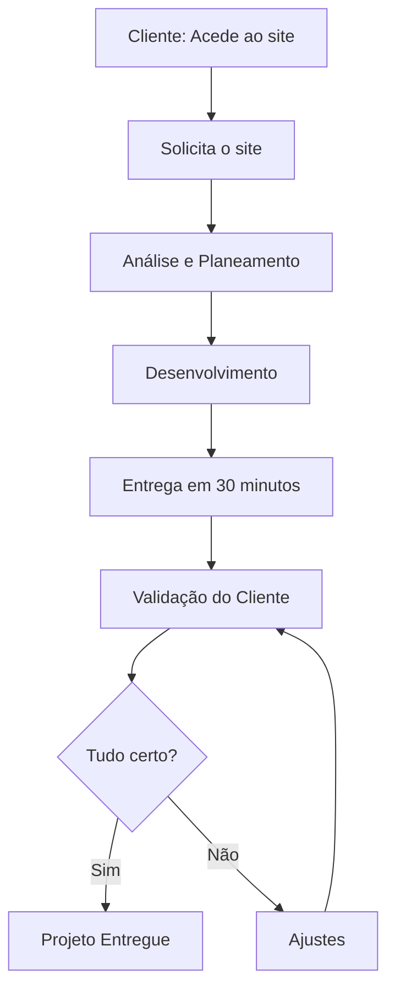

# PurpleSprint

O **PurpleSprint** é uma fábrica de software projetada para entregar sistemas web funcionais e personalizados em até **30 minutos**. O modelo de produção opera como uma esteira de montagem por estações interativas com presença humana constante, inspirada na dinâmica de produção do jogo *Purble Place*, onde cada fase constrói e valida uma parte específica do produto final até à entrega.

---

## Sumário

- [Visão Geral](#visão-geral)
- [Conceito do Projeto](#conceito-do-projeto)
- [Fluxo de Trabalho](#fluxo-de-trabalho)
- [Detalhamento das Estações](#detalhamento-das-estações)
- [Regras de Negócio](#regras-de-negócio)
- [Requisitos Funcionais](#requisitos-funcionais)
- [Requisitos Não Funcionais](#requisitos-não-funcionais)
- [Ferramentas Utilizadas](#ferramentas-utilizadas)
- [Processo de Atendimento](#processo-de-atendimento)

---

## Visão Geral

O PurpleSprint otimiza o tempo de desenvolvimento inicial de software, reduzindo semanas de alinhamento para uma jornada direta de 30 minutos. Utilizando uma abordagem orientada a estações, a equipa humana guia o cliente desde a conceitualização rápida até à validação em tempo real.

---

## Conceito do Projeto

A analogia central do PurpleSprint é o jogo *Purble Place*, especificamente a etapa de montagem do bolo:

* **Entrada de Ingredientes:** Coleta estruturada das necessidades do cliente por meio de questionário prévio.
* **Estações de Montagem:** Passagem sequencial do projeto por etapas de análise, arquitetura e desenvolvimento.
* **Controlo de Qualidade e Entrega:** Teste imediato pelo cliente, ajustes pontuais e entrega do produto finalizado.

---

## Fluxo de Trabalho

### Detalhamento das Estações

 - **Cliente / Acesso:** O cliente acede ao site da fábrica de software.
 - **Solicitação do Site:** O cliente envia a sua ideia e descreve as funcionalidades que deseja por meio do questionário.
 - **Análise e Planeamento:** A equipa entende o projeto, organiza as funcionalidades e prepara o desenvolvimento.
 - **Desenvolvimento:** A equipa cria o site com todas as funcionalidades solicitadas, seguindo o que o cliente pediu.
 - **Entrega em 30 Minutos:** O site fica pronto e é entregue ao cliente em apenas 30 minutos.
 - **Validação do Cliente:** O cliente testa o site e confirma se todas as funcionalidades estão a funcionar.
 - **Avaliação (Tudo Certo?):** Ponto de decisão onde se verifica a aprovação do cliente.
 - **Ajustes (se necessário):** A equipa faz as correções solicitadas pelo cliente caso surjam inconformidades.
 - **Projeto Entregue:** O cliente recebe o site completo, com todas as funcionalidades e pronto para usar.

### Regras de Negócio

**RN01** – Tempo Limite de Produção: O tempo total para o desenvolvimento e entrega da primeira versão funcional do software é estritamente limitado a 30 minutos.
**RN02** – Alinhamento Prévio Obrigatório: A fase de desenvolvimento só é iniciada após o cliente realizar a reunião de alinhamento de 5 minutos com a equipa humana.
**RN03** – Submissão do Questionário: O cliente deve obrigatoriamente responder ao questionário de requisitos e definir a modalidade de atendimento no momento do agendamento.
**RN04** – Ciclo de Ajustes Apenas por Inconformidade: Os ajustes realizados na estação de correção devem restringir-se exclusivamente ao que foi originalmente acordado no planeamento.
**RN05** – Viabilidade do Escopo: Caso a ideia do cliente exceda a capacidade de entrega em 30 minutos, a equipa deve propor um MVP (Produto Mínimo Viável) adequado à sprint durante a reunião de 5 minutos.

### Requisitos Funcionais

**RF01** – Agendamento e Seleção de Modalidade: O sistema deve permitir ao cliente agendar uma reunião de 5 minutos e selecionar a modalidade de atendimento pretendida.
**RF02** – Formulário de Recolha de Ideias: O sistema deve disponibilizar um questionário onde o cliente possa descrever a sua ideia e listar as funcionalidades pretendidas.
**RF03** – Acompanhamento do Estado do Projeto: O sistema deve exibir visualmente o estado atual do projeto nas diferentes estações de produção.
**RF04** – Módulo de Validação e Feedback: O sistema deve disponibilizar uma interface para que o cliente teste e aprove o software ou solicite ajustes.
**RF05** – Integração com Antigravity e Stitch: A infraestrutura deve estar integrada com as ferramentas Antigravity e Stitch para assegurar a geração e montagem rápida do software.

### Requisitos Não Funcionais

**RNF01** – Tempo de Resposta e Desempenho: A esteira de produção deve garantir que o sistema final seja compilado e disponibilizado para testes em menos de 30 minutos.
**RNF02** – Usabilidade e Simplicidade: A interface do formulário e da área de validação deve ser intuitiva para utilizadores sem conhecimentos técnicos.
**RNF03** – Confidencialidade dos Dados: Todos os dados transmitidos pelo cliente sobre o seu projeto devem ser protegidos e encriptados.
**RNF04** – Disponibilidade da Plataforma: O serviço de agendamento e preenchimento de questionários deve estar disponível 24 horas por dia, 7 dias por semana.
**RNF05** – Robustez dos Componentes: Os componentes gerados pelas ferramentas Stitch e Antigravity devem apresentar código limpo e funcional.

### Ferramentas Utilizadas

**Antigravity:** Plataforma e estrutura de suporte para aceleração da automação de processos e desenvolvimento de software.
**Stitch:** Ferramenta de integração e composição de componentes para aceleração da criação de interfaces e arquitetura de código.

### Processo de Atendimento
**Agendamento:** O cliente agenda um horário diretamente na plataforma da fábrica de software.
**Escolha da Modalidade:** Seleção da modalidade de atendimento mais adequada ao perfil do projeto.
**Preenchimento do Questionário:** Fornecimento dos detalhes da ideia e das funcionalidades pretendidas antes do encontro.
**Reunião de Alinhamento (5 min):** Validação humana do escopo com a equipa.
**Sessão Sprint:** Passagem pelas estações de Análise, Desenvolvimento, Entrega em 30 minutos, Validação e Ajustes até ao envio do produto final.

